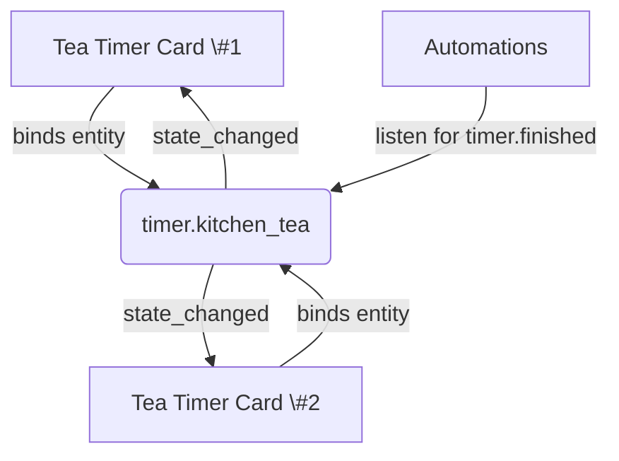

# Multi-instance & sync

Tea Timer cards stay synchronized through the Home Assistant timer entity they share. Use these
patterns to build dashboards with one or many timers while keeping every device in lock-step.



## Single timer on multiple dashboards

- **Use case:** You want the same timer visible on a wall tablet, phone, and desktop view.
- **Configuration:** Point each card to the same entity id (for example `timer.kitchen_tea`).
- **Behavior:** Any device can start/restart the timer; others update within a fraction of a second.
  The **Done** overlay appears everywhere at the same time because each instance receives the same
  `timer.finished` event.

## Multiple timers in one view

- **Use case:** Separate timers for tea and coffee or different rooms.
- **Configuration:** Give each card its own timer helper. The
  [`examples/lovelace/tea-timer-card-two-timers.yaml`](../examples/lovelace/tea-timer-card-two-timers.yaml)
  file demonstrates two cards that share preset definitions but target `timer.kitchen_tea` and
  `timer.living_room_tea` respectively.
- **Behavior:** Cards operate independently—starting one does not affect the other.

## Shared automations

Automations that trigger on `timer.finished` can include multiple timer entities:

```yaml
triggers:
  - platform: event
    event_type: timer.finished
    event_data:
      entity_id:
        - timer.kitchen_tea
        - timer.living_room_tea
```

Use conditions or choose actions based on `trigger.event.data.entity_id` to branch per room. The
[`examples/automations/timer-finished.yaml`](../examples/automations/timer-finished.yaml) sample
sends different notifications depending on which timer finishes.

## Handling entity renames

If you rename a timer helper, update every card and automation that references it:

1. Edit each Lovelace card and replace the `entity` value.
2. Update automations to match the new entity id.
3. Reload the dashboard or refresh the browser to clear cached configuration.

The card detects missing entities and shows an error banner until the configuration is corrected.

## Sync troubleshooting tips

- **Out-of-sync countdowns:** Ensure all clients have a stable WebSocket connection. The card pauses
  while disconnected and resyncs once reconnected.
- **Unexpected restarts:** Check for other automations calling `timer.start` on the same entity.
- **Drift after reconnect:** See [Troubleshooting](troubleshooting.md#countdown-drift-after-reconnect)
  for guidance on the clock skew estimator and when to disable it.
