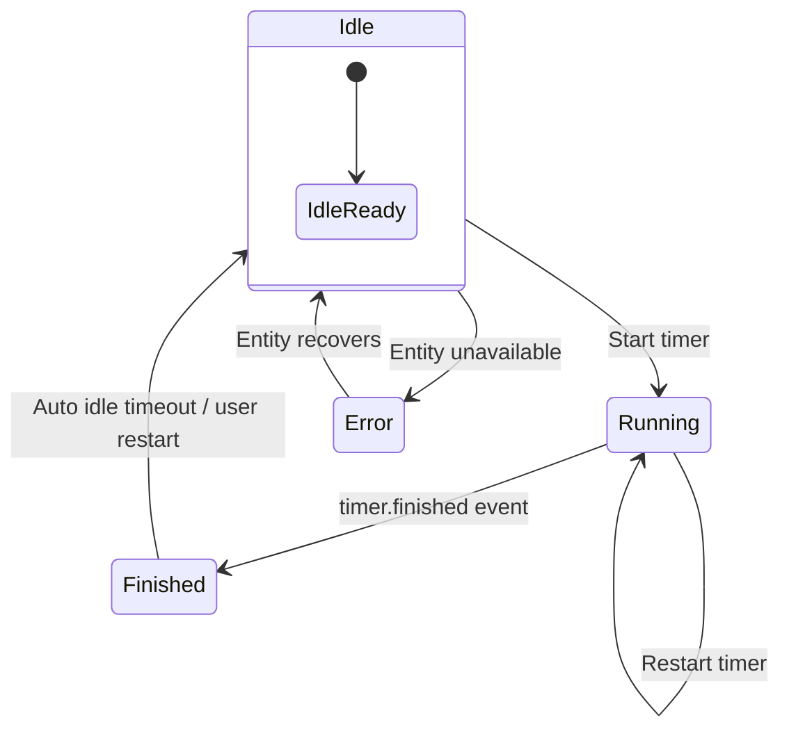

# State & actions

The Tea Timer Card mirrors the lifecycle of a Home Assistant `timer` entity. Understanding each
state helps you predict how the card reacts to taps, keyboard input, and automations.

## Idle

- **What you see:** Dial is interactive, presets respond instantly, subtitle shows the selected
  preset or custom duration.
- **Actions available:**
  - Drag the dial or use arrow keys/PageUp/PageDown to change the duration (rounded to `stepSeconds`).
  - Tap/click/press **Space** or **Enter** anywhere on the card body to start the timer.
  - Pick a preset to update the dial.
- **Announcements:** Screen readers hear the selected preset and duration when it changes.

## Running

- **What you see:** Dial locks, a progress arc fills clockwise, remaining time updates once per
  second (throttled for screen readers), and queued presets appear as a subtitle.
- **Actions available:**
  - Tap/click the card to restart with the queued duration.
  - Change presets—the card queues the new selection for the next restart without interrupting the
    current brew.
  - Tap the **+1:00** extend chip to add the configured increment to the remaining time. Each tap
    coalesces with others within 200 ms to avoid duplicate service calls.
  - Cancel or restart the timer from any device; changes propagate immediately.
- **Announcements:**
  - Start/restart events use a polite live region (“Brew started for Green Tea – 2 minutes”).
  - Queued preset announcements (“Next preset selected: Herbal – 5 minutes”).
  - Extends announce “Added one minute. New remaining: mm:ss.” while cap and race conditions
    announce the relevant outcome.

## Finished (transient)

- **What you see:** The card displays **Done** with an optional preset label. A translucent overlay
  lasts `finishedAutoIdleMs` milliseconds (default 5000) before returning to Idle.
- **Actions available:**
  - Tap/click/press **Space** or **Enter** to restart immediately using the same duration or a queued
    preset.
  - Let the overlay expire; the card automatically returns to Idle and restores dial interaction.
- **Announcements:** “Brew finished – Done” with the preset label when available.

## Error / unavailable

- **What you see:** The card shows an alert banner if the timer entity is missing, unavailable, or
  mis-typed. The dial and actions are disabled until the entity recovers.
- **Actions available:** Fix the underlying entity (rename, recreate, or re-enable it). The card
  resubscribes automatically when the entity becomes available.

## Connection loss

- **What you see:** A “Disconnected” banner and paused countdown while the Home Assistant WebSocket
  reconnects.
- **Actions available:** Wait for reconnection or refresh the browser. Once reconnected the card
  fetches the latest timer state and resumes normal behavior.

## Keyboard & pointer shortcuts

- **Start or restart:** **Space** or **Enter** when the card is focused.
- **Adjust duration:**
  - **Arrow keys:** ±`stepSeconds`.
  - **PageUp/PageDown:** ±30 seconds.
  - **Home/End:** Jump to min/max bounds.
- **Confirm restart:** When `confirmRestart` is enabled, the dialog captures focus so keyboard users
  cannot accidentally dismiss it.

## Service calls

The card never modifies timers locally. Instead it issues Home Assistant service calls:

- `timer.start` with `duration` when starting or restarting.
- `timer.change` to extend a running brew when Home Assistant supports the service and the result
  stays within the duration set by the last `timer.start`.
- `timer.start` with the updated remaining time when `timer.change` is unavailable or would exceed
  its cap. The card smooths the UI so the progress arc lengthens without flashing.

This approach keeps Home Assistant authoritative for countdowns and ensures events such as
`timer.finished` fire exactly once per completion. Automations should continue to listen for
`timer.finished` (not `timer.started`) to avoid duplicate triggers when the card restarts the timer
to extend it.
